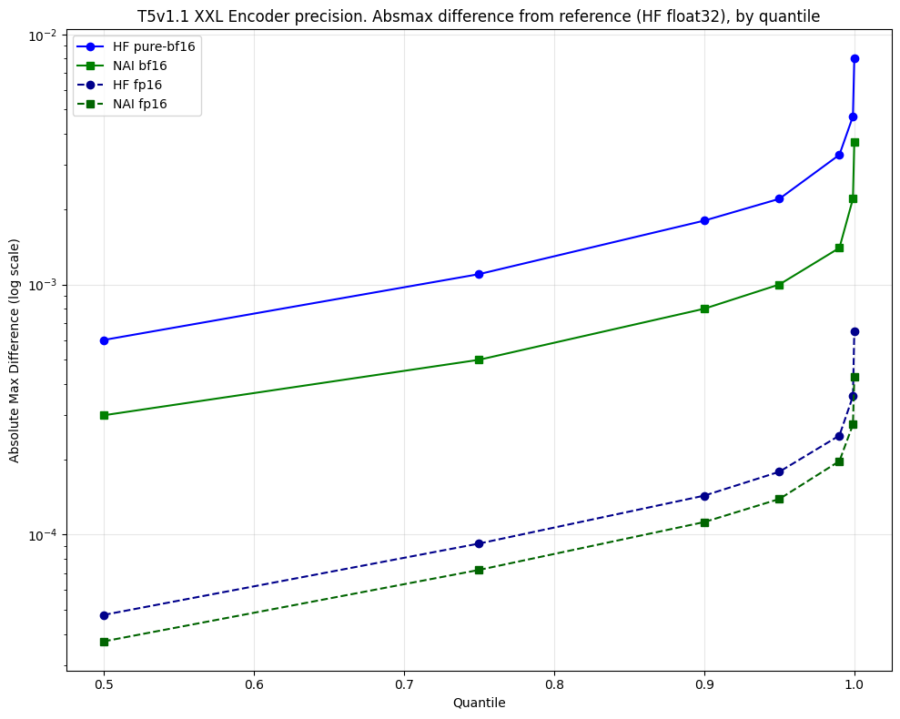

# NovelAI T5

Model code for T5. Designed to be fast and have good float16 support.  
Somewhat tidy.  
Somewhat tested.

## Install

Install the `nai-t5` package.  
Currently distributed via GitHub only; we install via the repository URL.

```bash
# installs nai-t5
pip install git+https://github.com/NovelAI/t5.git
```

Other packages you'll probably want:

```bash
# Sentencepiece tokenizer recommended, but you can use HF tokenizers too
pip install sentencepiece
# tensorizer recommended for weight-loading
pip install tensorizer async_timeout
```

We recommend sentencepiece as tokenizer. See [tokenization](docs/tokenizers.md) docs for our reasoning.

## Get weights

See [weight loading](docs/get-weights.md) docs for how to convert HF weights to a format we can load, and to update the tokenizer model with the special tokens it's missing.

## Usage

See [encoder usage](docs/usage-encoder.md) or [decoder usage](docs/usage-decoder.md) docs.  
Typically you'll want to use the encoder, but the decoder can be useful for querying T5 to determine concepts it understands.

## What's included

### Performance features

- torch SDPA attention in encoder + decoder
- Flex attention in encoder (optional)
  - ignores padding keys
  - ignores padding queries (uses safe_softmax to give these positions 0-probability)
- fused projections
  - QKV fusion in self-attention
  - KV fusion in cross-attention
  - in-projection fusion in GEGLU
- RMSNorm scales can be fused into subsequent linear projections
- KV cache support
  - just one big re-used tensor (avoids repeatedly reallocating a tensor as the sequence grows)
- UMT5 per-layer position embedding fusion (all layers computed concurrently)
- FFN out-proj is allowed to run in half-precision without the use of autocast

### PyTorch idioms

- RMSNorm built-in
- GELU built-in

### Compatibility

- masking
  - 3-dim packing mask or 2-dim padding mask
- support for v1.1 (GEGLU) and v1.0 (ReLU)
- support for UMT5 (e.g. EleutherAI's pile-t5) per-layer position embeddings
- supports SentencePiece tokenizer
- supports disabling attention scale, for compatibility with Google checkpoints
  - Google burned the attention scale into the weights, which had no detriment to training dynamics because Adafactor optimizer scales param lr w.r.t the RMS of the params ([more detail here](https://x.com/Birchlabs/status/1821188959201845745))

### Training considerations

- weight init (basic attempt)
- supports conventional attention scale (`head_dim**-.5`)

### Float16 considerations

See how we approached [docs/float16.md](float16 support).

## Precision

Precision compared via [`t5_encoder_hf_precision_parity.py`](scripts/t5_encoder_hf_precision_parity.py), using environment:

```
transformers 4.49.0
torch 2.6.0
CUDA 12.8
Nvidia Driver Version: 535.216.01
triton 3.2.0+git35c6c7c6
apex layernorm **not** used by transformers (commented-out of modeling_t5.py to avoid import)
NVIDIA H100 80GB HBM3
nai-t5 using norm fusion but not using flex attention or torch compilation
```

On T5v1.1 XXL, we compare HF vs nai-t5 half-precision implementations to see how close each gets to HF float32.  
nai-t5 half-precision implementations get closer than HF to the float32 reference in every quantile.



```
absmax diff quantiles:
[0.5000, 0.7500, 0.9000, 0.9500, 0.9900, 0.9990, 0.9999]

HF float32 vs HF pure-bf16:
[0.0006, 0.0011, 0.0018, 0.0022, 0.0033, 0.0047, 0.0080]
HF float32 vs NAI bf16:
[0.0003, 0.0005, 0.0008, 0.0010, 0.0014, 0.0022, 0.0037]

HF float32 vs HF fp16:
[4.7763e-05, 9.2119e-05, 1.4318e-04, 1.7839e-04, 2.4898e-04, 3.5743e-04, 6.5168e-04]
HF float32 vs NAI f16:
[3.7434e-05, 7.2266e-05, 1.1227e-04, 1.3884e-04, 1.9671e-04, 2.7551e-04, 4.2810e-04]
```

<!--
if apex is allowed to be imported, which changes HF's layernorm:

HF float32 vs HF bf16:
[0.0006, 0.0012, 0.0018, 0.0023, 0.0033, 0.0051, 0.0094]
HF float32 vs NAI bf16:
[0.0003, 0.0005, 0.0008, 0.0010, 0.0014, 0.0022, 0.0037]

couldn't measure fp16 because apex seems to only work in mixed-precision.
apex layernorm didn't like receiving float32 input with float16 weight.
-->

nai-t5 has the advantage of a float32 residual.  
HF has the advantage of running FFN out-projections in float32, which is costly.  
Runtime performance should be compared too to understand the cost/benefit tradeoff of where extra precision was purchased.

The two implementations use entirely different approaches to float16. HF takes the risk that activation-clipping could impact outliers. nai-t5 takes a risk of float16 underflow in its residual stream. both are more accurate than their bfloat16 counterparts.

## Philosophy

Main objective was to modernize T5 with Torch SDPA attention and write in a clearer code style.

- type hints
- document return types via NamedTuple
- document tensor shapes via einops rearrange
- pass KV cache as a forward argument to be mutated; no impact on return types
- clearer separation of concerns between encoder/decoder/model
  - avoid weight-tying and shared references
- prefer to duplicate modules rather than add conditions to existing modules to make them multi-use
  - makes it clearer that there are 3 types of attention, and they can be optimized differently
  - makes it clearer that encoder does not use a KV cache
- eliminate unused configurables
  - for example we do not keep "tie emb to lm_head"
  - keep only what's needed for final shipped models (e.g. v1.1 and v1.0), not ablations

## Shelved ideas

We considered fusing the decoder's every cross-attention KV projection, but it's questionable whether this would provide any speedup (KV is work that can be done concurrently with Q anyway), and it would complicate FSDP (the very wide fused KV projection would need to be chunked to achieve good compute/communication overlap).

MaskedTensor could be used to exploit sparsity on padded fixed-length sequences. Fixed-length sequences help to enable torch.compile dynamic=False. This would be particularly beneficial when inferencing the decoder, as the sequence length keeps changing (but could be modelled as a fixed-length MaskedTensor).